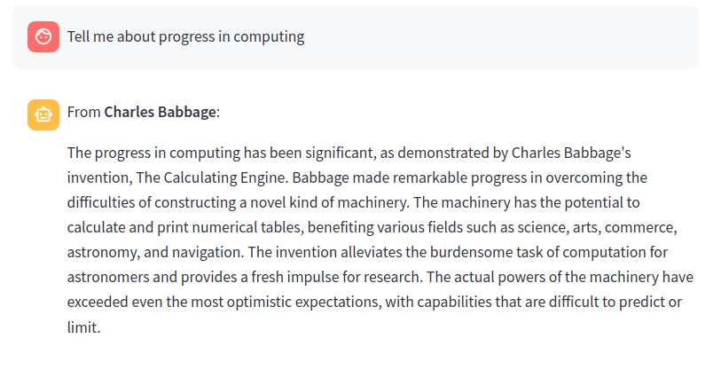
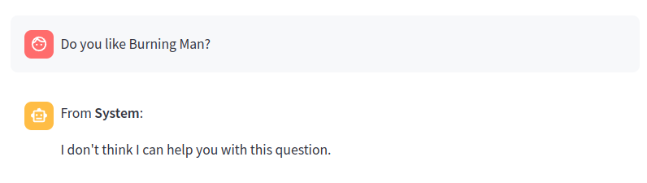
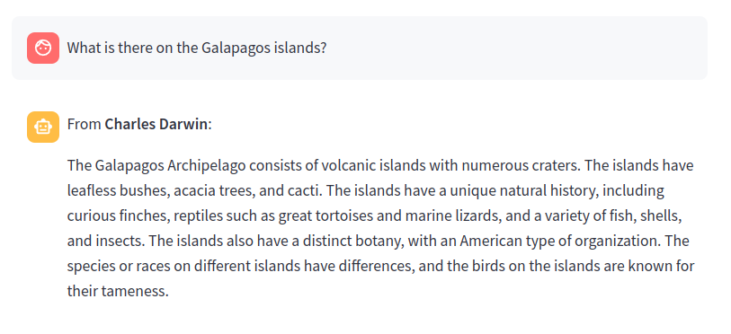

.. _tutorial_3:

Step 3: A knowledge network
================================

Now for the best part. The central idea with KnowledgeNet is to make knowledgebases connect with each other,
forming a network. We'll do that now.

We will create a knowledge base that looks at your query and then, if it seems to apply to the topics of Babbage,
Darwin or Galton, consults with the relevant specialist knowledge bases. If the query doesn't match any of them,
the knowledge base should tell you it doesn't know.

To do this, the knowledge base needs descriptions of the knowledge bases to connect with. This is provided in JSON files
in the directory :code:`examples/knowledgebases/victorian`.

Make sure that the knowledge base servers we started are still running. Then run

.. code-block:: bash

   $ streamlit run streamlit_ui_with_config.py -- examples/knowledgebases/victorian

A chat page should open in your browser.

